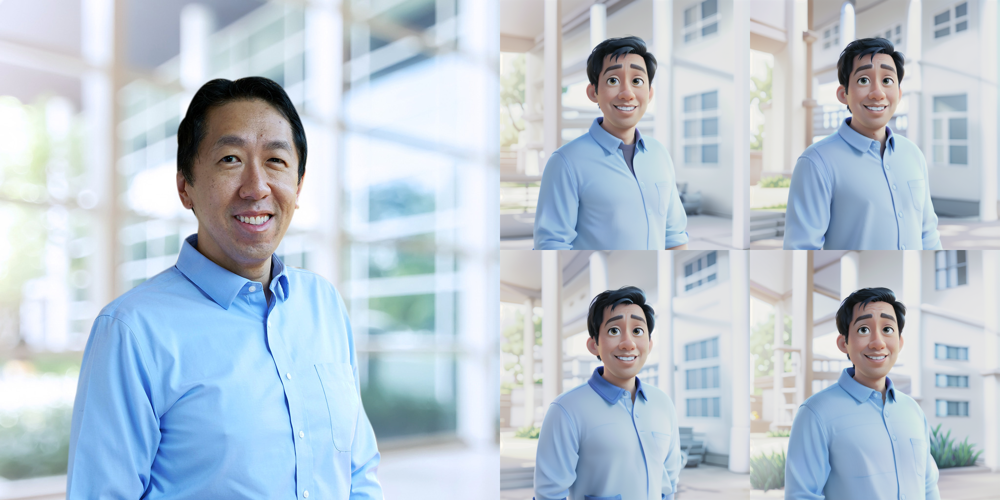

# pixar-sd-portraits

This repository is dedicated to transforming user-submitted portrait images into personalized cartoon characters that mimic the Pixar animation style using Stable Diffusion 1.5 or XL models.

## Objective

The primary objective of this project is to develop a minimal, workable code solution capable of:
1. Taking user-submitted portrait images
2. Transforming them into personalized cartoon characters in the Pixar animation style, preserving key facial attributes and a recognizable degree of the individual's identity


## Repository Contents

The repository features the following main components:
- `notebooks/`: notebooks that contain the same code as in the serve folder, but in a decomposed, easy-to-run format.
- `src/`: planned to store some abstractions around the pipeline in a more optimized way, but currently only contains a utils file.
- `assets/`: sample assets
- `serve/`: folder with two files:
   - '00_sdxl_pixar_lora_demo.py' - runs the SDXL demo with face IP-Adapter + Pixar LoRA that I took from civitAI. You can find my fork here: https://huggingface.co/animte/pixar-sdxl-lora
   - '01_sd1.5_pixar_demo.py' - same as 00, but uses the SD1.5 finetuned checkpoint on Pixar images. It looks much better than the SDXL variant. I recommend running this demo.

## Environment Setup Instructions

To begin experimenting with Pixar-style portrait generation, set up your environment by following these steps:

1. Create a new conda environment:
   ```bash
   conda create --name pixarsd python=3.10
   ```

2. Activate the environment:
   ```bash
   conda activate pixarsd
   ```

3. Install Python dependencies:
   ```bash
   pip install -r requirements.txt
   ```

4. Run the gradio demo:
   ```bash
   python serve/01_sd1.5_pixar_demo.py
   ```

5. Alternatively, you can run the Jupyter notebook in the `notebooks` folder:
   ```bash
   jupyter lab --no-browser --ip 0.0.0.0 --port 8888 --allow-root --notebook-dir=.
   ```

# Approach


The approach is pretty classic at this stage. I used IP-Adapter, SD model, and Pixar LoRA (Low-Rank Adaptation).

In both pipelines, I first take the user's picture, retrieve the face region using the insightface `buffalo_l` model, then crop the face and pass it as a condition for the IP-Adapter face SD model in an image-to-image style. 

## Next Steps for Improvements:

This is a POC right now, so it has a lot of directions to improve:
1. Generation speed: I've tested both pipelines on an NVIDIA A100 GPU. It took around 10 seconds to generate 4 images at 1024x1024 resolution. There are modern ways to compile torch models, using for example https://github.com/chengzeyi/stable-fast or https://github.com/NVIDIA/TensorRT. These frameworks could speed up diffusion models up to 2 times! Also, activation caching could help.
2. To improve results, it makes sense to collect a dataset and finetune the model in an image-to-image setting. For example, we could generate more pairs (real photo - styled in Pixar) and train a more narrow, smaller, quantized model to generate such images.
3. IP-Adapter is only one approach among many. There are also ConsistentID (https://github.com/JackAILab/ConsistentID), InstantID (https://instantid.github.io/), Photomaker (https://github.com/TencentARC/PhotoMaker), FastComposer (https://github.com/mit-han-lab/fastcomposer), FaceAdapter (https://huggingface.co/h94/IP-Adapter-FaceID), and many others. It makes sense to experiment with each, as they could return more consistent images with stable identity preservation due to training on a larger set with the same use case as ours (avatar creation).

## Results:

### SD1.5:





### SDXL:


